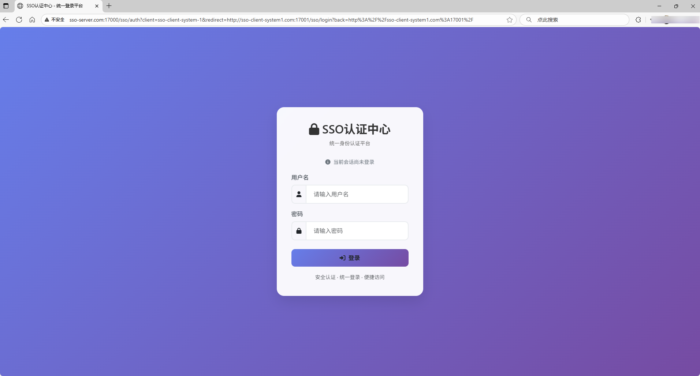
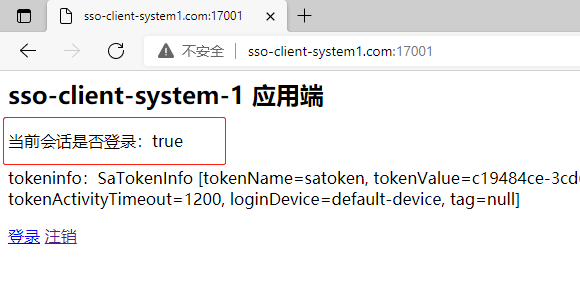

# sso-demo


> 基于 [sa-token](https://sa-token.cc/) 实现单点登录系统
* https://github.com/netbuffer/sso-demo
* https://gitee.com/netbuffer/sso-demo
* https://sa-token.cc/doc.html#/sso/readme 单点登录简介

## help
1. 编辑 C:\Windows\System32\drivers\etc\hosts  
添加域名映射记录到hosts中
```
127.0.0.1 sso-server.com
127.0.0.1 sso-client-system1.com
127.0.0.1 sso-client-system2.com
```   
2. 访问 http://sso-client-system1.com:17001 页面显示未登录  
  
点击登录按钮，跳转到sso-server认证中心
3. 重定向到[sso-server认证中心](http://sso-server.com:17000/sso/auth?client=sso-client-system-1&redirect=http://sso-client-system1.com:17001/sso/login?back=http%3A%2F%2Fsso-client-system1.com%3A17001%2F)  
  
输入帐号密码点击登录,认证成功后会回跳到sso-client-system1应用  
4. 此时回跳到sso-client-system1应用,sso-client-system1应用自身认证通过,回显登录成功  
  
5. 访问 http://sso-client-system2.com:17002 页面显示未登录
  
点击登录按钮，跳转到sso-server认证中心,此时sso-server检测到登录态,携带ticket直接回跳回来  
6. 页面回跳回来,sso-client-system2应用自身解析出ticket参数,再调用认证中心的检测ticket接口校验,检测完成后认证成功,页面回显登录成功  
